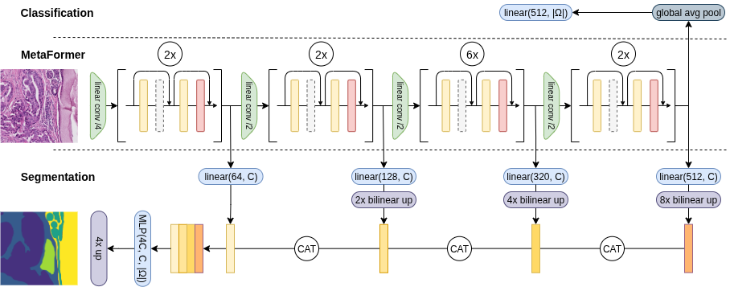

# Shaken or Stirred? An Analysis of MetaFormer's Token Mixing for Medical Imaging

[Paper](https://arxiv.org/abs/)

Extension of the MetaFormer architecture for both global (classification) and dense (segmentation) prediction tasks in medical imaging.
We provide a modular PyTorch Lightning implementation of MetaFormer with interchangeable token mixers, including:
+ Pooling
+ Convolution
+ Grouped Convolution
+ Identity (no token mixing)
+ Global Self-Attention
+ Local Self-Attention

Our model supports:
+ ImageNet-pretrained weights
+ Weight transfer from pretrained global to local attention as warm start



## Implementation Details
We use PyTorch Lightning for a modular implementation and Clear-ML to monitor our experiments.
In case you do not depend on Clear-ML (even they offer a free plan), you can either comment out the Clear-ML code lines or run it offline (
see [here](https://clear.ml/docs/latest/docs/faq/#can-i-run-clearml-task-while-working-offline---)).

### Environment
Please use the provided yaml (environment.yml) file to create the environment.
```bash
conda env create -f environment.yml
```

### Training
To reproduce our results, use the CLI interface of PyTorch Lightning.
This allows easy modification of model parameters directly from the command line.
Please refer to the documentation in our code for a detailed description of each parameter.
To select a token mixer `t`, please choose from the following options:
- `loc_attn`: local attention
- `full_attn`: global attention
- `pooling`: pooling
- `conv`: convolution
- `sep_conv`: grouped convolution
- `identity`: no token mixing

When applicable, you can also define the kernel size `k`.

#### Classification
To train a classification model on our selection of four MedMNIST datasets for 35k iterations, use the following command sequence:

```bash
pairs=(
    50 pathmnist
    648 dermamnist
    972 pneumoniamnist
    324 organsmnist
    3888 NoduleMNIST3D
)

# for 3D replace model with 3D variant
# AdaptiveMetaformerClassifier3D
# PretrainedMetaformer3D

# MetaFormer [T, T, T, T] from scratch
for ((i=0; i<${#pairs[@]}; i+=2)); do
    e=${pairs[i]}
    d=${pairs[i+1]}
    python -m train_classifier fit \
        --model AdaptiveMetaformerClassifier \
        --model.ds_name $d \
        --model.tokenmixer $t \
        --model.kernel_size $k \
        --data MedMNISTDataModule \
        --data.ds_name $d \
        --trainer configs/base_trainer.yaml \
        --trainer.devices [0] \
        --trainer.max_epochs $e
done

# MetaFormer [P, P, T, T]
for ((i=0; i<${#pairs[@]}; i+=2)); do
    e=${pairs[i]}
    d=${pairs[i+1]}
    python -m train_classifier fit \
        --model PretrainedMetaformer \
        --model.ds_name $d \
        --model.tokenmixer $t \
        --model.kernel_size $k \
        --model.pretrained true \ # whether to use imagenet pretrained weights or trained from scratch
        --model.attention_weights_warm_start true \ # whether to use weight transfer from global → local attention
        --data MedMNISTDataModule \
        --data.ds_name $d \
        --trainer configs/base_trainer.yaml \
        --trainer.devices [0] \
        --trainer.max_epochs $e
done

# ResNet Baseline
for ((i=0; i<${#pairs[@]}; i+=2)); do
    e=${pairs[i]}
    d=${pairs[i+1]}
    python -m train_classifier fit \
        --model CNNClassifier \
        --model.ds_name $d \
        --model.kernel_size $k \
        --model.pretrained true \ # whether to use imagenet pretrained weights or trained from scratch
        --data MedMNISTDataModule \
        --data.ds_name $d \
        --trainer configs/base_trainer.yaml \
        --trainer.devices [0] \
        --trainer.max_epochs $e
done

# RAD DINO
for ((i=0; i<${#pairs[@]}; i+=2)); do
    e=${pairs[i]}
    d=${pairs[i+1]}
    python -m train_classifier fit \
        --model RadDinoClassifier \
        --model.ds_name $d \
        --data MedMNISTDataModule \
        --data.ds_name $d \
        --trainer configs/base_trainer.yaml \
        --trainer.devices [0] \
        --trainer.max_epochs $e
done
```

To train on ImageWoof (a non-trivial subset of ImageNet):
```bash
# MetaFormer [T, T, T, T] from scratch
python -m train_classifier fit --model AdaptiveMetaformerClassifier --model.ds_name imagewoof --model.kernel_size $k --model.tokenmixer $t --data ImageWoofDataModule --trainer configs/base_trainer.yaml --trainer.devices [0]

# MetaFormer [P, P, T, T]
do python -m train_classifier fit --model PretrainedMetaformer --model.ds_name imagewoof --model.kernel_size $k --model.tokenmixer $t --model.pretrained false/true --model.attention_weights_warm_start false/true --data ImageWoofDataModule --trainer configs/base_trainer.yaml --trainer.devices [0]

# ResNet Baseline
do python -m train_classifier fit --model CNNClassifier --model.ds_name imagewoof --model.kernel_size $k --model.tokenmixer $t --model.pretrained false/true --data ImageWoofDataModule --trainer configs/base_trainer.yaml --trainer.devices [0]

# RAD DINO
python -m train_classifier fit --model RadDinoClassifier --model.ds_name imagewoof --data ImageWoofDataModule --trainer configs/base_trainer.yaml --trainer.devices [0]
```

#### Segmentation

To train our segmentation models on GrazPedWri (wristbone) and JSRT:
```bash
# MetaFormer encoder [T, T, T, T] + SegFormer decoder
python -m train_segmentator fit --model MetaFormerSegmentator --model.ds_name wristbone/jsrt --model.token_mixer $t --model.kernel_size $k --data SegGrazPedWriDataModule/JSRTDataModule --trainer configs/base_trainer_seg.yaml --trainer.max_epochs 1000

# UNet Baselines: UNet and UNet on first MetaFormer's patch embedding to match its receptive field
python -m train_segmentator fit --model UNetSegmentator/UNetOnPatchEmbedding --model.ds_name wristbone/jsrt --model.conv_kernel $k --data SegGrazPedWriDataModule/JSRTDataModule --trainer configs/base_trainer_seg.yaml --trainer.max_epochs 1000

# RAD DINO
python -m train_segmentator fit --model RadDinoSegmentator --model.ds_name wristbone/jsrt --data SegGrazPedWriDataModule/JSRTDataModule --trainer configs/base_trainer_seg.yaml --trainer.max_epochs 1000
```

and on the TIGER dataset utilizing a patch-based approach with patch size 768x768:
```bash
# MetaFormer encoder [T, T, T, T] + SegFormer decoder
python -m train_segmentator fit --model MetaFormerSegmentator --model.ds_name tiger --model.token_mixer $t --model.kernel_size $k --data TIGERDataModule --data.spatial_size 768 --trainer configs/base_trainer_seg.yaml --trainer.max_epochs 1000

# UNet Baselines: UNet and UNet on first MetaFormer's patch embedding to match its receptive field
python -m train_segmentator fit --model UNetSegmentator/UNetOnPatchEmbedding --model.ds_name tiger --model.conv_kernel $k --data TIGERDataModule --data.spatial_size 768 --trainer configs/base_trainer_seg.yaml --trainer.max_epochs 1000

# RAD DINO
python -m train_segmentator fit --model RadDinoSegmentator --model.ds_name tiger --data TIGERDataModule --data.spatial_size 768 --trainer configs/base_trainer_seg.yaml --trainer.max_epochs 1000
```

and on the AbdomenAtlas dataset for a 3D setting:
```bash
# MetaFormer encoder [T, T, T, T] + SegFormer decoder
python -m train_segmentator fit --model MetaFormerSegmentator3D --model.ds_name "$d"  --model.token_mixer "$t" --model.kernel_size "$k" --data AbdomenAtlasDataModule --trainer configs/base_trainer_seg.yaml --trainer.max_epochs "$e" --trainer.check_val_every_n_epoch 5

# UNet Baseline
python -m train_segmentator fit --model UNetSegmentator3D --model.ds_name "$d" --model.conv_kernel "$k" --data AbdomenAtlasDataModule --trainer configs/base_trainer_seg.yaml --trainer.max_epochs "$e" --trainer.check_val_every_n_epoch 5
```


### Evaluation
You can evaluate the classification and segmentation models on the respective test sets by providing their CLEAR-ML task id to the following commands:
```bash
python -m eval.eval_classification [CLEAR-ML TASK ID]
python -m eval.eval_segmentation [CLEAR-ML TASK ID]
```

## Data
All the data should be in the `data` folder. Please refer to our dataset implementations for the directories name.

### MedMNIST
Just install the `medmnist` package and the data will be automatically downloaded, when instantiating the
`MedMNISTDataModule`.
```bash
pip install medmnist
```

### ImageWoof
Please refer to the [repository](https://github.com/fastai/imagenette?tab=readme-ov-file#imagewoof) for downloading the
data.
Since we resize the images to 224x224 pixel, the 320px version is sufficient.

### JSRT Datset
Please refer to
ngaggion's [repository](https://github.com/ngaggion/Chest-xray-landmark-dataset/blob/main/Preprocess-JSRT.ipynb) to
download and preprocess the JSRT dataset as well for his provided landmarks.
We further reduce the resolution to 256x256 pixel and organize the images and landmarks as two pytorch tensors in a
python dictionary `JSRT_img0_lms.pth`.
Please notice, we store the already z-normalized versions of the images.
To create the segmentation mask from the landmarks, we utilize `skimage.draw.polygon2mask` function. Under
`dataset/generate_jsrt_seg_lbl.py` we provide the code to generate the segmentation masks from the landmarks.

### GrazPedWriDataset
Please download the dataset using the provided link in the
original [paper](https://www.nature.com/articles/s41597-022-01328-z) and preprocess it with their provided notebooks to
obtain the 8-bit images.
After this, please use the lateral code provided in the `dataset.csv` (downloaded from the same source as the images)
and flip all "right hand" images to show a "left hand" and hence create a homogeneous dataset.

For this dataset, we provide the segmentation masks for 17 bones of 63 images.
The masks are encoded within the xml files in `/data/cvat_annotation_xml` and automatically parsed when instantiating
the `SegGrazPedWriDataModule`.

### TIGER Dataset
Please download the data from the [challenge website](https://tiger.grand-challenge.org/Data/).
We limit our experiments to the subset WSIROIS since the come with dense annotations.

### AbdomenAtlas 1.0
Please download the data from its [repository](https://github.com/MrGiovanni/AbdomenAtlas).